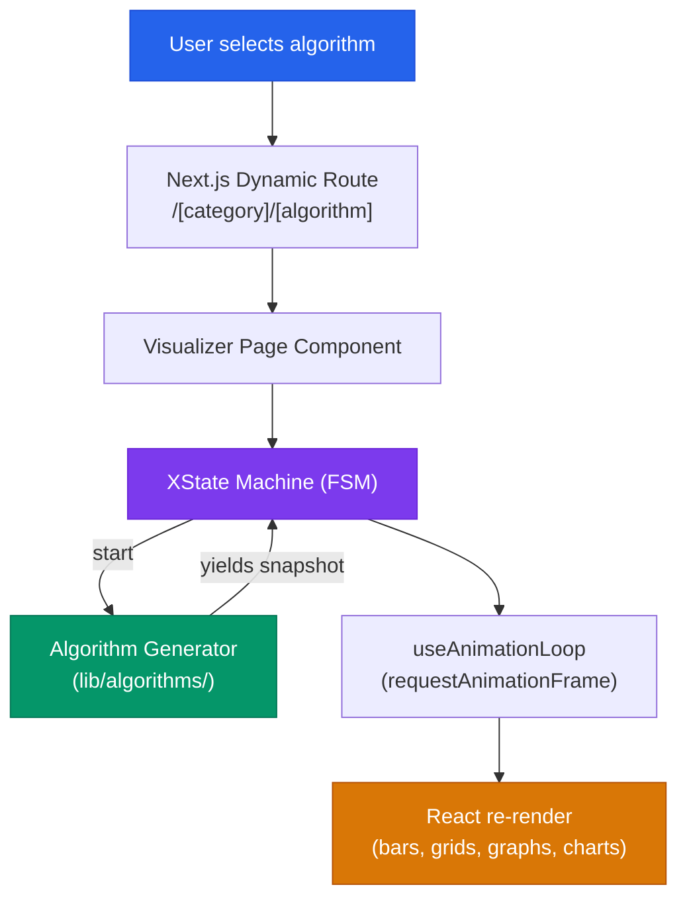

# AlgoViz — Interactive Algorithm Visualizer

A web-based platform for visualizing algorithms in real time. Built with **Next.js 16** (App Router), **TypeScript**, and **Tailwind CSS v4**, AlgoViz provides step-through playback, adjustable speed controls, and detailed complexity analysis for **25+ algorithms** across 8 categories.

---

## Features

- **Real-time step-through playback** — play, pause, step forward, and reset any algorithm with adjustable animation speed
- **Algorithm info panels** — syntax-highlighted pseudocode (Shiki), time/space complexity breakdowns, and plain-language descriptions
- **State-machine driven** — each visualizer type is backed by an XState finite state machine for deterministic, debuggable animation flows
- **Light and dark themes** via `next-themes` with a consistent design-token palette
- **Responsive layout** — collapsible sidebar, mobile-friendly header, full-width visualizer canvas

---

## Supported Algorithms

| Category | Algorithms |
|---|---|
| Sorting | Bubble Sort, Insertion Sort, Selection Sort, Merge Sort, Quick Sort, Heap Sort, Radix Sort |
| Searching | Linear Search, Binary Search, Jump Search |
| Path Finding | Depth-First Search, Breadth-First Search, Dijkstra's, A* Search |
| Shortest Path | Dijkstra's, Bellman-Ford, Floyd-Warshall |
| MST | Prim's, Kruskal's |
| AI / ML | Linear Regression, K-Nearest Neighbors, K-Means Clustering, Perceptron (MLP) |
| Games | N-Queen, Sudoku Solver, Game of Life, Knight's Tour, Minimax (Alpha-Beta) |
| Classic | Tower of Hanoi |

---

## Tech Stack

| Layer | Technology |
|---|---|
| Framework | Next.js 16 (App Router, React 19) |
| Language | TypeScript 5 |
| Styling | Tailwind CSS v4, tw-animate-css |
| UI Components | shadcn/ui (Radix UI + CVA) |
| State Management | Zustand |
| Animation State | XState v5 |
| Graph Rendering | React Flow (@xyflow/react) |
| Charts | Visx |
| Syntax Highlighting | Shiki |
| Icons | Lucide React |
| Theming | next-themes |

---

## Project Structure

```
algov2/
├── app/                          # Next.js App Router
│   ├── layout.tsx                # Root layout, fonts, providers
│   ├── globals.css               # Design tokens, Tailwind config
│   └── (visualizer)/             # Route group
│       ├── page.tsx              # Landing page
│       └── [category]/[algorithm]/page.tsx
│
├── components/
│   ├── layout/                   # Header, Sidebar, SidebarNav
│   ├── visualizer/pages/         # Per-category visualizer UIs
│   ├── common/                   # Shared controls, code viewer, etc.
│   ├── ui/                       # shadcn/ui primitives
│   └── providers/                # Theme + app providers
│
├── config/
│   └── algorithms.ts             # Algorithm registry (metadata, source, complexity)
│
├── lib/
│   ├── algorithms/               # Generator-based algorithm implementations
│   │   ├── sorting/  searching/  pathfinding/  shortest-path/
│   │   ├── mst/  ai/  games/  classic/  shared/
│   │   └── registry.ts           # Algorithm-to-generator lookup
│   ├── hooks/                    # React hooks (animation loop, machine wrappers)
│   ├── machines/                 # XState state-machine definitions
│   └── types/                    # TypeScript type definitions
│
├── stores/index.ts               # Zustand store (sidebar, current algorithm)
├── next.config.ts                # Redirects, standalone output
└── package.json
```

---

## Architecture



Each algorithm is implemented as a **generator function** that yields animation snapshots. XState machines manage the lifecycle (`idle` → `running` → `paused` → `complete`), and `useAnimationLoop` drives frame-by-frame playback via `requestAnimationFrame`.

---

## Getting Started

### Prerequisites

- **Node.js** >= 18 or **Bun** >= 1.0

### Installation

```bash
# Clone
git clone https://github.com/<your-username>/algov2.git
cd algov2

# Install dependencies (bun recommended — lockfile is bun.lock)
bun install

# Start development server
bun dev
```

Open **http://localhost:3000** to start exploring.

### Scripts

| Script | Description |
|---|---|
| `dev` | Start the Next.js development server |
| `build` | Create a production build (standalone output) |
| `start` | Serve the production build |
| `lint` | Run ESLint |

---

## Routing

Category URLs redirect to their default algorithm:

| Route | Default Redirect |
|---|---|
| `/sorting` | `/sorting/bubble-sort` |
| `/searching` | `/searching/linear-search` |
| `/path-finding` | `/path-finding/breadth-first-search` |
| `/shortest-path` | `/shortest-path/dijkstra` |
| `/mst` | `/mst/prim` |
| `/ai` | `/ai/linear-regression` |
| `/games` | `/games/n-queen` |
| `/classic` | `/classic/tower-of-hanoi` |

---

## License

This project is private. See repository settings for access details.
